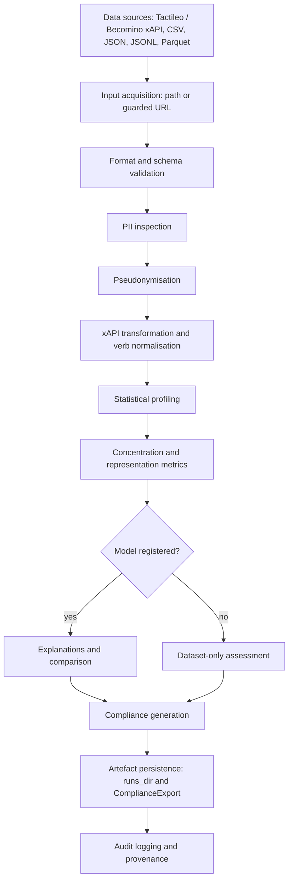

# AffectLog's Trustworthy AI (ALT-AI) - Design Document

AffectLog's Trustworthy AI (ALT-AI) is the AffectLog component of the Prometheus-X
**Trustworthy AI Assessment** Building Block (BB04), delivered in EDGE-Skills WP3
deliverable **D3.7** alongside CARiSMA and LOLA. Within that toolbox, ALT-AI applies
**at operation time**, where an AI model and/or data pipeline already exists, and
supports trustworthiness assessment through dataset–model interface profiling
(identifiers, sparsity, drift), concentration and representation indicators, and
audit-oriented documentation outputs.

ALT-AI is **dataset-first**: its primary subject is the dataset and the dataset–model
interface. Model-attached analysis (feature importance, explanation, comparison) is a
supported secondary mode that requires a registered model. It aids transparency and
interpretability and provides evidence supporting regulatory obligations under the
GDPR and the EU AI Act.

> **Document status.** This file is referenced as the building block's design document
> in D3.7 §5.1, together with the [Test Specification](#test-specification) section
> cited there for unit and component-level tests. It originated as the TRL 1–2
> conceptual baseline and is now maintained as the current authoritative design,
> reconciled against the submitted D3.7 text and the code in this repository.
> **D3.7 is the submitted, authoritative deliverable and is not modified by this
> repository**; where this documentation set and D3.7 differ, the repository is
> corrected — never the reverse. The original conceptual material is preserved under
> [Implementation Details → Historical concept baseline](#historical-concept-baseline).
>
> Sections describing the current system use the present tense and cite a source path;
> historical statements use the past tense and are confined to the historical baseline;
> planned work uses explicit roadmap wording. Every capability carries a status from
> the vocabulary in [Requirements](#status-vocabulary). Full alignment means every
> D3.7 commitment and repository claim is stated consistently and traceably — it does
> **not** mean every conceptual capability is fully implemented.

**Submitted deliverable in this repository:** `docs/D3.7-final-BB-Trustworthy AI.docx`
(text rendering: `docs/D3.7-final-BB-Trustworthy AI.docx.md`).

**Path convention.** Implementation modules are cited relative to the
`src/affectlog/` package (for example `metrics/coverage.py`); all other paths are
relative to the repository root (for example `docs/openapi.yaml`). Every cited path,
relative link, in-page anchor and `make` target in this document is verified by
`scripts/check_doc_references.py`.

## Technical Usage Scenarios & Features

ALT-AI assesses datasets destined for, or produced by, AI systems in education and
skills data spaces. It supports dataset-only assessment as its default mode, and
global (overall model behaviour) and local (individual prediction) explanations when a
model is attached. It helps users:

- Inspect schema, identifiers and residual PII before data is shared or used for training
- Quantify concentration, coverage and representation skew across entities and activities
- Understand which features influence model outcomes, when a model is registered
- Compare models for performance, when two or more models are registered
- Produce audit-oriented documentation aligned to GDPR and EU AI Act Annex IV

The toolbox is designed to be flexible and scalable while prioritising privacy,
security and auditability.

### Features/Main Functionalities

D3.7 §5.2 lists five headline functionalities. Each maps to implementation as follows:

| D3.7 functionality | Implementation | Status |
| --- | --- | --- |
| Multi-stage audit workflow for educational xAPI datasets | `src/affectlog/recipes/runner.py::run_audit`, `configs/recipes/*.yaml` | Implemented |
| Dynamic schema parser supporting nested JSON and CSV exports | `src/affectlog/ingest/schema_infer.py`, `src/affectlog/profiling/schema_profiler.py` | Implemented |
| Fairness metric suite: Gini, Coverage@K, nDCG, Representation Index | `src/affectlog/metrics/` | Implemented with qualification |
| Pseudonymisation benchmarking with SHA-256 and reversible salt variants | `src/affectlog/privacy/pseudonymizer.py` | Implemented with qualification |
| Automated Annex IV metadata exporter (JSON-LD) | `src/affectlog/compliance/ai_act_annex_iv.py`, `compliance/jsonld.py` | Implemented |

**Metric suite detail.**

| Metric | Function | Requires |
| --- | --- | --- |
| Gini index | `metrics/concentration.py::gini_index` | dataset only |
| Coverage@K | `metrics/coverage.py::compute_coverage` | dataset only |
| Representation index | `metrics/representation.py::representation_index` | dataset only |
| nDCG@K | `metrics/recommender.py::ndcg_at_k` | **recommendations + relevance judgements** |
| Precision / Recall / Hit-rate@K | `metrics/recommender.py` | recommendations + relevance |
| Quality indicators | `metrics/quality.py::compute_quality` | dataset only |

*Qualification.* All four D3.7-named metrics exist. **nDCG is not a dataset-only
metric** — it requires a recommendation list and relevance judgements, and is
therefore not produced by a plain dataset profile run.

*Pseudonymisation qualification.* Salted SHA-256 and HMAC-SHA256 variants are
implemented and comparable, satisfying the "benchmarking … variants" commitment. A
**reversible** variant is **not implemented**: no reverse-mapping or key-escrow
facility exists anywhere in `src/`.

**Fairness scope.** `metrics/fairness.py::compute_fairness` measures representation
across observed activity categories. **Sensitive-attribute fairness is deliberately
not computed** — it is gated on approved metadata and a lawful basis that the
reference deployment does not assume.

Supporting capabilities: dataset ingestion (CSV, JSON, JSONL, Parquet), schema
validation, PII inspection, pseudonymisation, xAPI transformation and verb
normalisation, statistical profiling, compliance artefact generation, recipe-driven
orchestration, a guided assessment workflow, a REST API, a React frontend,
authentication and RBAC, and self-hosted Docker deployment.

### Technical Usage Scenarios

**Scenario A — Tactileo teacher logs (dataset-only).** xAPI events are ingested,
identifiers inspected and pseudonymised, activity skew profiled, and concentration
indicators computed; SOP-style outputs document the field inventory and configuration.
D3.7 reports Gini = 0.68 and Coverage@10 = 72% for the RP1 analysis. These are
**reported analysis results for that dataset**, not software performance guarantees,
and are not reproduced by the repository test suite.

**Scenario B — Becomino interaction logs (dataset-only).** Anonymised logs are
validated for structural consistency, verbs are normalised across xAPI sources,
descriptive profiling is performed, and compliance-ready metadata is generated.

**Scenario C — model-attached assessment.** A model is registered through a model
adapter; feature importance, explanation and model comparison become available.

**Scenario D — audit and compliance.** ALT-AI produces documentation supporting audits:
Data Card, Model Card, GDPR field inventory, EU AI Act Annex IV metadata, SOP and a
JSON-LD compliance graph.

**Scenario E — dataset engineering.** Profiling and concentration outputs inform
splitting, weighting and stratified-monitoring decisions where a raw log distribution
is not representative.

## Requirements

<a id="status-vocabulary"></a>

**Status vocabulary** used throughout this document:

| Status | Meaning |
| --- | --- |
| **Implemented** | Code exists, is reachable, and is exercised by tests |
| **Implemented with qualification** | Implemented for a defined subset; a broader reading is not supported |
| **Optional** | Requires an optional dependency; degrades gracefully when absent |
| **Conditional** | Active only under configuration or an edition flag |
| **Mock-validated** | Exercised against a mock/stub, not a live external service |
| **Interface specified** | Schema/contract published; no live counterparty exercised |
| **Configuration pending** | Implemented but inert until deployment configuration is supplied |
| **Externally dependent** | Blocked on a third party or partner endpoint |
| **Roadmap** | Designed or scaffolded, not functionally implemented |
| **Not evidenced** | Claimed somewhere but without supporting implementation |

- **R1:** MUST support integration with popular Python-based ML frameworks, including
  scikit-learn, and, where feasible, TensorFlow and PyTorch models via wrappers. Also
  supports numpy, pandas for data handling, and onnxruntime for ONNX models.
- **R2:** MUST provide APIs for generating explanations, feature importance scores,
  and model comparisons.
- **R3:** MUST ensure data privacy, security, and must not require access to raw
  personal data for explanation generation.
- **R4:** SHOULD leverage partner infrastructure for scalability and handle large
  datasets and complex models efficiently.

### R1 — ML framework interoperability

A pluggable adapter layer normalises heterogeneous model artefacts and endpoints
behind a single `predict` contract, resolved through `src/affectlog/models/registry.py`.

| Framework | Implementation | Dependency | Status |
| --- | --- | --- | --- |
| scikit-learn | `models/sklearn_adapter.py` | core | Implemented |
| ONNX | `models/onnx_adapter.py` | `onnx` extra | Optional |
| PyTorch | `models/torch_adapter.py` | `torch` extra | Optional |
| TensorFlow/Keras | `models/tensorflow_adapter.py` | `tensorflow` extra | Optional |
| HTTP / black-box | `models/http_adapter.py` | core | Implemented |
| Dummy (test double) | `models/dummy_adapter.py` | core | Implemented |
| NumPy / pandas | ingestion and array interchange | core | Implemented |

**Evidence:** `tests/unit/test_model_adapters.py`.
**Qualification:** the ONNX, PyTorch and TensorFlow adapters are exercised through
their adapter contract; they are **not** validated against production-trained partner
models in this repository, and their extras are not installed by default.

### R2 — Explanations, feature importance and model comparison

| Capability | Implementation | Status |
| --- | --- | --- |
| Feature importance | `explanations/generator.py::generate_feature_importance` | Implemented |
| Permutation importance | `explanations/feature_importance.py::permutation_importance` | Implemented |
| SHAP explanation | `explanations/generator.py::_shap_importance`, `explanations/shap_adapter.py` | **Optional** |
| Global / local explanation | `explanations/generator.py::generate_explanations` | Implemented with qualification |
| Model comparison | `explanations/generator.py::compare_models` | Implemented |
| REST exposure | `POST /v1/models/{model_id}/explain`, `GET /v1/explanations/{model_id}/feature-importance`, `POST /v1/models/compare` | Implemented |

**Model requirement.** Every R2 capability requires a **registered model**
(`POST /v1/models/register`). None operates in dataset-only mode; dataset-only runs
produce profiling, concentration and representation outputs instead.

**SHAP behaviour.** `method="auto"` attempts SHAP and falls back to permutation
importance when SHAP is absent or raises; the fallback is logged. Permutation
importance requires labels `y`. `shap` is an optional extra, not a core dependency.

**Evidence:** `tests/unit/test_explanations.py`.

### R3 — Privacy and security

The requirement is satisfied **for explanation generation**, which operates on model
artefacts and feature matrices. It must not be generalised into a claim that ALT-AI
never touches raw personal data.

**ALT-AI does read raw source datasets.** Identifier inspection and pseudonymisation
are only possible by reading the source records. The system is designed to *detect and
reduce* identifiers, not to avoid encountering them.

| Control | Implementation | Default | Status |
| --- | --- | --- | --- |
| PII detection | `privacy/pii_detector.py` | active | Implemented (regex/heuristic, not ML-based) |
| Pseudonymisation | `privacy/pseudonymizer.py` | `pseudonymize=True` | Implemented |
| Keyed pseudonymisation | HMAC-SHA256, truncated to 32 chars | requires `AFFECTLOG_HASH_SECRET` | **Conditional** |
| Unkeyed fallback | salted SHA-256, truncated | when secret unset | Implemented with qualification |
| Reversible pseudonymisation | — | — | **Not evidenced** |
| Raw exports | `raw_exports_enabled` | `False` | Implemented |
| Password hashing | `auth/password.py` Argon2id + pepper | pepper default empty | Conditional |

**Correction of earlier wording.** Previous revisions stated that ALT-AI "operates on
aggregated model artifacts and anonymized datasets". That described only the
*prospective* PDC-mediated integration and was incorrectly generalised. Corrected:

- ALT-AI ingests **raw source datasets** for profiling and pseudonymisation.
- Output is **pseudonymised**, which under GDPR Recital 26 remains **personal data** —
  it is *not* anonymisation.
- Truncated hashing without a configured secret is susceptible to brute-force
  re-identification over small identifier spaces; `AFFECTLOG_HASH_SECRET` must be set
  wherever personal data is processed.

**Operator responsibilities.** Lawful basis, retention scheduling, TLS termination,
secret management, backup policy and data-subject request handling are deployment-time
responsibilities and are not supplied by the reference stack.

**Regulatory posture.** ALT-AI **supports** and **provides evidence for** GDPR and EU
AI Act obligations. It does not certify, guarantee or establish compliance.

**Evidence:** `tests/unit/test_pii_detection.py`, `tests/unit/test_pseudonymizer.py`.

### R4 — Scalability

| Aspect | Implementation | Status |
| --- | --- | --- |
| Lazy scanning / streaming | `ingest/large_file.py` (Polars lazy scan) | Implemented |
| CSV / JSON / JSONL / Parquet | `ingest/*_reader.py` | Implemented |
| 1 M-row throughput | `tests/performance/test_synthetic_million_rows.py` | Implemented, `@pytest.mark.slow` |
| Background execution | `jobs/worker.py` | **Roadmap** — sleep-poll stub |
| Run-state persistence | in-memory + filesystem for pipeline routers | Implemented with qualification |

**Execution model.** Pipeline work executes **synchronously** in the API process, or
asynchronously via FastAPI `BackgroundTasks`/threads. The Compose `worker` service runs
a polling stub; **no Celery application consumes the configured Redis broker.** Redis is
provisioned and healthy but is not a live task backend.

**Benchmark provenance.** The 1 M-row test is deselected from the default gate
(`pytest -m "not slow"`). Any throughput or memory figure quoted elsewhere derives from
`make benchmark` on a specific host and is **not** reproduced by the standard CI run.
See [ADR 0002](adr/0002-large-dataset-processing.md).

## Integrations

### Direct Integrations with Other BBs

- **CARiSMA (Trustworthy AI BB).** ALT-AI publishes a JSON Schema and export builder
  for operation-time dataset/model audit findings
  (`src/affectlog/interoperability/carisma.py`), enabling CARiSMA's design-time
  analysis to be complemented by operation-time evidence.
  Status: **Interface specified / export-only** — no live integration.
- **LOLA (Trustworthy AI BB).** ALT-AI exports dataset-level profiling and algorithm
  evaluation metadata (`src/affectlog/interoperability/lola.py`).
  Status: **Interface specified / export-only** — no live integration.
- **Decentralized AI Training BB.** ALT-AI may integrate with models produced by that
  BB to provide post-training analyses. Feasibility was to be established with the
  owning team. Status: **Externally dependent / Roadmap** — not implemented in RP1.

CARiSMA and LOLA support means ALT-AI's **own** metadata-exchange schemas, export/import
formats and worked examples — **not** a completed live integration with those tools.
This matches the caveat recorded in `ROADMAP.md`. Envelope construction is shared via
`interoperability/metadata_exchange.py`.

**Evidence:** `tests/integration/test_carisma_lola_metadata.py`.

### Integrations via Connector

- **Prometheus-X Data Space Connector (PDC).** `src/affectlog/pdc/client.py` implements
  artefact requests and ODRL policy evaluation. It defaults to `mock=True`; a real
  `httpx` branch activates only when `AFFECTLOG_PDC_URL` is configured. A mock server
  (`pdc/mock_server.py`) and routes `POST /v1/pdc/request-model-artifacts` and
  `POST /v1/pdc/mock/policies/evaluate` are exposed.
  Status: **Mock-validated**; the live branch is **Configuration pending** and
  **Externally dependent**.
- **ODRL policy enforcement.** `src/affectlog/compliance/odrl.py` produces policy
  artefacts, evaluated against the mock connector. Status: **Mock-validated**.
- **Live LRS ingestion.** Not implemented. Status: **Roadmap**.

Where PDC-mediated model retrieval becomes available, ALT-AI would operate on model
artefacts under consent and policy enforcement. That prospective mode is distinct from
ALT-AI's dataset assessment path, which reads source data by design (see R3).

**Evidence:** `tests/integration/test_pdc_mock.py`.

### Partner data integrations

- **Maskott / Tactileo.** Teacher xAPI traces; Maskott CSV → xAPI transformation and
  schema `maskott_csv_v1`. Status: **Implemented**.
- **Inokufu / Becomino.** Anonymised learner interaction logs; template inference and
  verb normalisation. Status: **Implemented**.
- **External HTTP models.** `models/http_adapter.py`. Status: **Implemented**.

## Relevant Standards

### Data Format Standards

| Standard | How ALT-AI relates | Status |
| --- | --- | --- |
| JSON / CSV / JSONL / Parquet | Native ingestion formats | Implemented |
| xAPI | Transformation and verb normalisation across sources | Implemented |
| OpenAPI 3.1 | Contract at `docs/openapi.yaml`; live spec at `/openapi.json` | Implemented |
| JSON-LD | Compliance graph export | Implemented |
| W3C PROV | `compliance/provenance.py` | Implemented with qualification |
| ODRL | Policy artefacts; evaluated against the mock PDC | Mock-validated |

### Documentation and regulatory standards

- **Model Cards** (Mitchell et al., 2019) — `compliance/model_card.py`. Implemented.
- **Data Cards** (Gebru et al., 2018) — `compliance/data_card.py`. Implemented.
- **GDPR** — ALT-AI generates a field inventory and pseudonymisation evidence and
  **supports** controller obligations. It processes pseudonymised personal data; it
  does not anonymise and does not establish compliance.
- **EU AI Act** — ALT-AI generates metadata fields **relevant to Annex IV** and
  **provides evidence for** technical documentation. The Act entered into force in
  August 2024 with obligations phasing in thereafter; it is **not** "upcoming".
- **DSSC guidelines** — followed for data-space interoperability. Supports.

ALT-AI **supports**, **maps to** and **provides evidence for** these frameworks. It
does not guarantee, certify or legally establish compliance.

## Input / Output Data

### Supported Model Types

- **Scikit-learn models** — directly supported via joblib or pickle serialisation.
- **ONNX models** — supported via `onnxruntime` wrappers (optional extra).
- **TensorFlow/Keras & PyTorch models** — supported via scikit-learn-like wrappers
  (optional extras).
- **HTTP / black-box endpoints** — supported via the HTTP adapter.

### Supported Data Formats

- **Tabular data** — pandas DataFrames or NumPy arrays as the primary in-memory forms.
- **CSV, JSON, JSONL, Parquet** — ingested by dedicated readers, with Polars lazy
  scanning for large files.

**Inputs**

| Input | Handler | Status |
| --- | --- | --- |
| CSV / JSON / JSONL / Parquet | `ingest/csv_reader.py`, `json_reader.py`, `jsonl_reader.py`, `parquet_reader.py` | Implemented |
| Large files | `ingest/large_file.py` | Implemented |
| Recipes (YAML) | `recipes/`, `configs/recipes/*.yaml` | Implemented |
| Verb mappings | `transform/verb_mapper.py` | Implemented |
| Model artefacts / endpoints | `models/` | Implemented / Optional per framework |
| Labels or ground truth | required by permutation importance and nDCG | Conditional |

**Ingestion boundary.** `POST /v1/datasets/ingest` registers a **file path**; the
guided workflow additionally fetches a **URL** behind an SSRF guard (`core/paths.py`).
There is **no browser file-upload endpoint** — a frequent misreading of "dataset
ingestion".

**Schema validation.** `ingest/validators.py::validate_schema` validates against
`KNOWN_SCHEMAS` (`maskott_csv_v1`); other formats return "not yet implemented" from the
validator while remaining readable and profileable. Status: **Implemented with
qualification**.

**Outputs**

| Output | Producer | Requires |
| --- | --- | --- |
| Normalised xAPI JSONL | `transform/maskott_csv_to_xapi.py` | dataset only |
| Schema / descriptive / temporal / sparsity / drift profiles | `profiling/` | dataset only |
| Concentration metrics (Gini, long-tail) | `metrics/concentration.py` | dataset only |
| Coverage@K, representation index | `metrics/coverage.py`, `metrics/representation.py` | dataset only |
| Recommender metrics (nDCG, P@K, R@K) | `metrics/recommender.py` | recommendations + relevance |
| Feature importance / explanations | `explanations/` | **dataset + registered model** |
| Model comparison | `explanations/generator.py::compare_models` | dataset + ≥2 models |
| Data Card / Model Card | `compliance/data_card.py`, `model_card.py` | dataset / model metadata |
| GDPR field inventory | `compliance/gdpr.py` | dataset only |
| EU AI Act Annex IV metadata | `compliance/ai_act_annex_iv.py` | dataset only |
| SOP | `compliance/sop.py` | dataset only |
| JSON-LD compliance graph | `compliance/jsonld.py` | dataset only |
| ODRL policy artefacts | `compliance/odrl.py` | dataset only |
| Provenance record | `compliance/provenance.py` | dataset only |
| Audit manifest / `config_hash` | `recipes/runner.py` | dataset only |
| Dashboard payload | `api/routers/audits.py` → frontend | dataset only |

**Artefact qualification.** Annex IV output is a **template populated with run
metadata**, not a per-model regulatory risk analysis; it provides evidence *for* an
Annex IV submission rather than constituting one.

**Persistence.** Audit artefacts are written to the filesystem `runs_dir`. Dataset, run
and guided-workflow state for the pipeline routers is held **in memory plus
filesystem**; the SQLAlchemy models in `db/models.py` are complete but are wired to
authentication, RBAC, tenancy and compliance-export records rather than to the pipeline
routers. Status: **Implemented with qualification**.

## Architecture

ALT-AI is a full-stack service. The runtime, rather than the original four-component
conceptual sketch, is authoritative; the original sketch is retained under
[Historical concept baseline](#historical-concept-baseline).

**Runtime components** (`docker-compose.yml`):

| Service | Image / build | Published port | Health check | Volume |
| --- | --- | --- | --- | --- |
| `postgres` | `postgres:16-alpine` | 5432 | yes | `postgres_data` |
| `redis` | `redis:7-alpine` | not published | yes | `redis_data` |
| `api` | `Dockerfile` | 8000 | yes | — |
| `worker` | `Dockerfile.worker` | none | no | — |
| `frontend` | `Dockerfile.frontend` | 3000 → 80 | no | — |
| `mailpit` | `axllent/mailpit:latest` | 8025, 1025 | no | — |

API health: `GET /healthz`; readiness `GET /readyz`; metrics `GET /metrics`. The
frontend is React + Vite served by nginx. Mailpit is a **development** mail sink. A
TLS/reverse-proxy service exists only as a commented example — TLS termination is an
operator responsibility.

**Component map**

| Concern | Package |
| --- | --- |
| API and routers | `src/affectlog/api/` |
| Model adapters | `src/affectlog/models/` |
| Explanations | `src/affectlog/explanations/` |
| Ingestion | `src/affectlog/ingest/` |
| Privacy | `src/affectlog/privacy/` |
| Transformation | `src/affectlog/transform/` |
| Profiling | `src/affectlog/profiling/` |
| Metrics | `src/affectlog/metrics/` |
| Compliance artefacts | `src/affectlog/compliance/` |
| Recipes | `src/affectlog/recipes/`, `configs/recipes/` |
| Guided workflow | `src/affectlog/wizard/` |
| Authentication and RBAC | `src/affectlog/auth/` |
| Tenancy | `src/affectlog/tenancy/` |
| Editions and feature flags | `src/affectlog/editions/` |
| PDC | `src/affectlog/pdc/` |
| Interoperability | `src/affectlog/interoperability/` |
| Persistence models | `src/affectlog/db/` |
| Worker (stub) | `src/affectlog/jobs/worker.py` |
| Frontend | `src/affectlog/frontend/` |

**Processing pipeline** — corresponds to D3.7 Figure 5 ("AffectLog Architecture and
Analysis Pipeline"):



| # | Step | Execution | State |
| --- | --- | --- | --- |
| 1 | Input acquisition | synchronous | filesystem |
| 2 | Format & schema validation | synchronous | in-memory |
| 3 | PII inspection | synchronous | in-memory |
| 4 | Pseudonymisation | synchronous | in-memory; **conditional** on secret |
| 5 | Transformation / normalisation | synchronous, streaming | filesystem |
| 6 | Profiling | synchronous | in-memory → filesystem |
| 7 | Concentration / fairness metrics | synchronous | in-memory → filesystem |
| 8 | Model analysis | synchronous | **optional**; requires model; SHAP optional |
| 9 | Compliance generation | synchronous | filesystem + DB record |
| 10 | Artefact delivery | synchronous | filesystem |
| 11 | Audit logging & provenance | synchronous | DB + filesystem |

No step is executed by an external queue worker.

**Authentication, RBAC and workspace model**

| Element | Implementation | Status |
| --- | --- | --- |
| RBAC seeding | `scripts/seed_rbac.py` | Implemented |
| Administrator creation | `scripts/create_initial_admin.py` | Implemented |
| Container bootstrap | `make docker-bootstrap` | Implemented |
| Password hashing | `auth/password.py` — Argon2id + pepper | Implemented |
| Password pepper | `AFFECTLOG_PASSWORD_PEPPER` | **Conditional** — default empty |
| Session authentication | `auth/sessions.py`; HttpOnly `affectlog_session` cookie | Implemented |
| Cookie `Secure` flag | `AFFECTLOG_COOKIE_SECURE` | Conditional — `false` by default |
| Authorization | `auth/dependencies.py::require_permission` / `require_superadmin` | Implemented |
| Account activation | `auth/onboarding.py::activate_account` | Implemented |
| Password reset | `auth/tokens.py` (TTL-bound tokens) | Implemented |
| Failed-login counter | `db/models.py::failed_login_count` | Implemented with qualification |
| MFA (TOTP) | `POST /api/auth/mfa/setup`, `/mfa/verify` | **Roadmap** — not enforced |
| Workspace / tenancy scoping | `tenancy/` | Implemented with qualification |

**The authentication runtime boundary.** A stored password hash is bound to **both**
the database it is written to **and** the `AFFECTLOG_PASSWORD_PEPPER` used to compute
it. Creating an administrator on the host while the API authenticates inside the
container against the Compose PostgreSQL database therefore yields an account the API
**cannot** verify, returning a generic `Invalid credentials`. Bootstrap must run inside
the API container (see Configuration and Deployment Settings). Rotating the pepper
invalidates every existing password hash. Super Admin bypasses permission checks by
design.

*(See `classDiagram-v1.1.png` for a class diagram and `sequenceDiagram-v1.1.png` for
dynamic behaviour. Detailed treatment: [architecture.md](architecture.md).)*

## Configuration and Deployment Settings

**Supported self-hosted sequence**

```bash
cp .env.example .env
# Set POSTGRES_PASSWORD and the required authentication secrets
docker compose up -d --build
make docker-bootstrap
```

`make docker-bootstrap` (= `docker-seed` + `docker-create-admin`) seeds RBAC and creates
the administrator **inside the API container**, using the same database and password
pepper as the running service. Bootstrap is an explicit initialisation step; it does not
run automatically on stack start. The README documents troubleshooting and a
data-preserving administrator recovery procedure.

**Key configuration**

| Setting | Purpose | Default |
| --- | --- | --- |
| `POSTGRES_PASSWORD` | Database credential; stack fails fast if unset | required |
| `AFFECTLOG_SECRET_KEY` | Session signing | warns if unset |
| `AFFECTLOG_PASSWORD_PEPPER` | Password hashing pepper | empty — set in production |
| `AFFECTLOG_HASH_SECRET` | HMAC pseudonymisation key | empty — falls back to salted SHA-256 |
| `AFFECTLOG_COOKIE_SECURE` | `Secure` flag on the session cookie | `false` |
| `AFFECTLOG_PDC_URL` | Enables the live PDC branch | unset (mock) |
| `raw_exports_enabled` | Permits raw data export | `False` |
| `pseudonymize` | Enables pseudonymisation | `True` |

**Deployment contexts**

1. **Host development** — API/worker run directly from a single `.env`; host and runtime
   share one configuration, so host-side bootstrap is correct there.
2. **Docker Compose self-hosting** — the reference stack above; bootstrap runs inside the
   API container.
3. **Managed production** — external secrets, TLS, backups, monitoring, rate limiting and
   image pinning. Status: **Roadmap / deployment-time**; not provided by the reference
   stack, which is a baseline and **not** a complete production-hardening specification.
4. **Consortium publication** — the official Prometheus-X repository is a **source of
   record**, not a deployment origin.

**Editions and feature flags.** `editions/features.py` defines 14 flags with
community/managed defaults (`MANAGED_PDC`, `BILLING`, `DEDICATED_WORKER_POOL` are off).
Per-tenant gate injection is not yet wired. Status: **Conditional**.

**Logging.** Process tracking, error handling and performance metrics are emitted via
`src/affectlog/logging.py`; audit and provenance records accompany each run.

**Repository promotion model**

```text
roy-saurabh/edge_affectlog                 development
roy-saurabh/t-ai-affectlog                 AffectLog release repository
Prometheus-X-association/t-ai-affectlog    official consortium source of record
```

Promotion is by reviewed pull request; no automated push to the consortium repository
exists.

## Third Party Components & Licenses

- **Pandas/Numpy:** BSD-3-Clause
- **scikit-learn:** BSD-3-Clause
- **Polars:** MIT
- **TensorFlow:** Apache-2.0 (optional extra)
- **PyTorch:** BSD-style (optional extra)
- **ONNX & onnxruntime:** MIT (optional extra)
- **SHAP:** MIT (optional extra)
- **FastAPI / Starlette / Pydantic:** MIT
- **SQLAlchemy / Alembic:** MIT
- **React / Vite:** MIT
- **PostgreSQL:** PostgreSQL License · **Redis:** RSALv2/SSPL (image as distributed)

**ALT-AI itself is released under the MIT License**, as recorded in D3.7 §5.1.

## Implementation Details

ALT-AI is built for flexibility, auditability and scalability. The assessment pipeline
(ingest → privacy → transform → profiling → metrics → compliance → recipe
orchestration → guided workflow → API → dashboard) and the authentication/RBAC stack
are implemented and align with this design, subject to the qualifications recorded
throughout.

### Known limitations and external dependencies

1. **No browser file-upload endpoint** — ingestion is path- or guarded-URL-based.
2. **Pipeline state is in-memory plus filesystem**; the DB models serve auth, RBAC,
   tenancy and compliance records.
3. **The Celery/Redis worker is a stub** — no queue consumer; async work runs in-process.
4. **The PDC connector is mock-first**; the live branch is configuration-pending and
   externally dependent.
5. **CARiSMA and LOLA support is export/schema-only** — no live integration.
6. **SHAP is an optional dependency**; absent it, explanations degrade to permutation
   importance, which requires labels.
7. **Schema validation covers `maskott_csv_v1`** only; other formats are readable but not
   formally validated.
8. **Sensitive-attribute fairness is not computed**; only representation over observed
   categories.
9. **nDCG and other recommender metrics require relevance judgements** and are not part of
   a dataset-only profile.
10. **Reversible pseudonymisation is not implemented.**
11. **MFA is scaffolded, not enforced.**
12. **Production hardening** (TLS, external secrets, image pinning, backups, rate
    limiting) is deployment-time and not part of the reference stack.
13. **Version metadata is inconsistent** across `src/affectlog/version.py` (`0.1.0`),
    `pyproject.toml` (`1.0.0`) and the frontend package (`1.1.0`). Recorded as a known
    discrepancy; reconciling it is a release-management action, not a documentation
    change.
14. **Advisory static-analysis findings** (mypy, bandit, pip-audit, npm audit) remain open
    and are non-blocking in CI.

<a id="historical-concept-baseline"></a>

### Historical concept baseline

*The following records the original TRL 1–2 conceptual design, written before
implementation, and is retained for auditability. Where it conflicts with the sections
above, those sections are authoritative. These statements describe intentions held at
the time of writing and are not descriptions of the delivered system.*

**Original framing.** ALT-AI was described as providing "a set of tools for explaining,
visualizing, and understanding complex machine learning models", with global and local
explanation, feature importance, model comparison and fairness analysis as the four
headline features. Implementation subsequently established a **dataset-first**
component in which model-attached explanation is one conditional mode among several.

**Original planning timeline.** Feasibility discussions (e.g., integration with the
Decentralized AI Training BB) were tentatively planned for Q1 2025, after which a more
precise timeline and roadmap was to be established; a high-level work plan was shared
with the relevant Building Block and Work Package leader. *Outcome:* that integration
was **not** implemented in RP1 and remains externally dependent. No PDC-mediated model
retrieval was performed.

**Original integration intent.** ALT-AI was to securely retrieve trained models — under
consent and policy enforcement via the PDC — and then perform AI risk assessment and
explainability tasks, "operating on aggregated model artifacts rather than raw data".
*Outcome:* the PDC client and ODRL evaluation exist and are mock-validated; live
retrieval was not performed. The "aggregated model artifacts" phrasing described this
*prospective* integration only and was incorrectly generalised in earlier revisions into
a claim about ALT-AI as a whole (see R3).

**Original conceptual architecture.** Four components were described — *Model Adapter*
(adapting ML models to a standardised format), *Explanation Generator* (explanations,
feature importances, comparisons), *Results Processor* (organising results), and
*Security Layer* (privacy and security during explanation). These map to `models/`,
`explanations/`, `reports/` + `compliance/`, and `privacy/` + `auth/` respectively; the
delivered runtime is materially larger and is described under Architecture.

**Original configuration notes.** Configuration was described as model type, explanation
type (global/local) and resource allocation, with logging for process tracking, error
handling and performance metrics, and possible usage limits on features, records or model
complexity.

## Partners & Roles

- **Prometheus-X Organization:** Governance and infrastructure frameworks; hosts the
  official consortium source of record.
- **AffectLog:** Develops and maintains ALT-AI.
- **Data Providers & Model Developers:** Supply data and models plus Data/Model Cards.
  In RP1: **Maskott** (Tactileo teacher xAPI traces) and **Inokufu** (Becomino
  anonymised learner logs).
- **End Users:** Data scientists, analysts, auditors and DPOs seeking interpretability
  and audit evidence.
- **Trustworthy AI BB partners:** University of Koblenz (CARiSMA) and LORIA (LOLA), with
  whom ALT-AI shares metadata-exchange formats.

## Usage In The Dataspace

- **Interoperability:** Standard formats (xAPI, JSON-LD, OpenAPI 3.1, ODRL) and
  documentation templates (Data Cards, Model Cards); metadata-exchange schemas for
  CARiSMA and LOLA.
- **Data Governance:** Pseudonymisation by default, raw exports disabled by default,
  policy artefacts and provenance records. PDC-mediated exchange is mock-validated and
  configuration-pending.
- **Scalability & Regulatory Readiness:** Polars lazy scanning for large datasets;
  audit-oriented outputs supporting GDPR and EU AI Act Annex IV documentation.
- **Execution locality:** Profiling can run within an isolated runtime on
  partner-controlled infrastructure, exporting only aggregate outputs — the model
  demonstrated in the RP1 use cases.

## Leveraging AffectLog for Organizational Skill Gap Analysis

ALT-AI supports skill-gap analysis primarily at the **dataset** level: concentration,
coverage and representation indicators characterise which learners, teachers or content
segments dominate the observed activity distribution, and where coverage is thin. A
marked long tail is treated as a *representational risk factor*, because models
calibrated on such distributions can underperform for underrepresented segments and
amplify dominant behavioural patterns in ranking or recommendation.

Where a model is registered, feature importance and comparison clarify which features
drive predicted skill shortages. That model-attached portion is **conditional** on a
registered model, and SHAP-based explanation is **optional**.

## OpenAPI Specification

The FastAPI backend serves a live OpenAPI 3.1 document at `/openapi.json`. The committed
contract at `docs/openapi.yaml` documents the **v1 assessment API** — 26 paths across
`/v1/datasets`, `/v1/transforms`, `/v1/audits`, `/v1/compliance`, `/v1/models`,
`/v1/explanations` and `/v1/pdc`, plus `/healthz`, `/readyz` and `/metrics` — covering
dataset ingestion, transformation, audit execution, model registration and explanation,
compliance exports and PDC connector operations.

The live application additionally registers authentication, admin, platform-admin,
public, editions, capabilities, interoperability and guided-workflow routers. These
appear in `/openapi.json` but are **not** part of the committed v1 contract file.

`scripts/validate_openapi.sh` validates the committed file's structure and reports its
version, title and path count; its Redocly lint step is advisory. Keeping the committed
contract synchronised with the live router set is therefore a **maintained convention**,
not a CI-enforced invariant.

---

## Test Specification

The acceptance test criteria defined here are fulfilled by the automated test suite in
`tests/`. Run with:

```bash
make test        # unit + integration (fast; equivalent to pytest -m "not slow")
make test-slow   # 1 M-row performance benchmark
make security    # bandit static analysis + pip-audit
make hygiene     # repository privacy guard
make lint        # ruff check + ruff format --check
```

| **Requirement** | **Test Module** | **What Is Verified** |
| --------------- | -------------- | -------------------- |
| R1 — ML framework adapters | `tests/unit/test_model_adapters.py` | Each adapter (sklearn, ONNX, PyTorch, TF, HTTP, dummy) accepts a numpy input and returns a prediction dict |
| R2 — Explanation APIs | `tests/unit/test_explanations.py` | Feature importance, permutation importance, and multi-model comparison return correctly structured dicts |
| R2 — API contract | `tests/integration/test_api_openapi_contract.py` | The live FastAPI app serves an OpenAPI 3.x document exposing `/healthz`, and core endpoints (`/readyz`, model register/predict, PDC policy evaluation) respond as specified |
| R3 — PII detection | `tests/unit/test_pii_detection.py` | Regex patterns flag direct identifiers; known Maskott fields (`EntityId`, `ActivitySessionId`) detected |
| R3 — Pseudonymisation | `tests/unit/test_pseudonymizer.py` | HMAC-SHA256 output is deterministic for same key, non-reversible, and different across keys |
| R4 — Scalability | `tests/performance/test_synthetic_million_rows.py` | 1 M-row CSV processed end-to-end (ingest → profile → metrics) within time bound; marked `slow` and deselected from the default gate |
| Concentration & fairness metrics | `tests/unit/test_metrics_fairness.py`, `tests/unit/test_metrics_concentration.py`, `tests/unit/test_metrics_coverage.py` | Gini ∈ [0,1]; balance ratio ∈ [0,1]; Coverage@K monotonically non-decreasing with K |
| xAPI transform | `tests/unit/test_csv_to_xapi_transform.py`, `tests/unit/test_maskott_csv_schema.py` | Maskott CSV rows produce valid xAPI statements with required fields |
| Becomino template inference | `tests/unit/test_becomino_template_inference.py` | Template inference over Becomino-shaped input |
| Recipe pipeline | `tests/unit/test_recipes.py`, `tests/integration/test_cli_audit_pipeline.py` | YAML recipe loads, runs, and produces a reproducible `config_hash` |
| JSON-LD export | `tests/unit/test_jsonld_export.py` | Output is valid JSON-LD with `@context`, `@type: AISystem`, and EU AI Act Annex IV fields |
| PDC connector | `tests/integration/test_pdc_mock.py` | Mock PDC server accepts ODRL-policy-gated requests and returns a dataset catalog |
| CARiSMA / LOLA exchange | `tests/integration/test_carisma_lola_metadata.py` | Export envelopes validate against the published metadata-exchange schemas |
| Guided workflow | `tests/integration/test_wizard_api.py`, `tests/unit/test_wizard_inspector.py`, `tests/unit/test_wizard_validator.py` | Guided-workflow inspection, validation and API flow |
| Authentication & RBAC | `tests/unit/test_auth_passwords.py`, `tests/unit/test_auth_tokens.py`, `tests/unit/test_rbac_permissions.py`, `tests/unit/test_registration_approval.py` | Argon2id + pepper hashing, token TTL, role→permission matrix, registration approval |
| Dataset transform API | `tests/integration/test_api_dataset_transform.py` | Dataset transform endpoint contract |
| Capability registry | `tests/unit/test_capability_registry.py` | Declared capability registry integrity |

**Scope note.** The contract test verifies that the live application serves a valid
OpenAPI 3.x document and that key endpoints behave as specified. It does **not** perform
a field-by-field diff of the live specification against `docs/openapi.yaml`.

For a full capability-to-test mapping, D3.7 requirements traceability, and the formal
TRL 5 evidence statement, see [docs/trl-assessment.md](trl-assessment.md) and
[docs/design-conformance.md](design-conformance.md).

---

## D3.7 Alignment

This document is the authoritative design document for the ALT-AI component of the
EDGE-Skills WP3 D3.7 deliverable. The progression from concept to validated
implementation follows this chain:

1. **This document** (`docs/design-document.md`) — requirements, architecture, standards
   alignment and status. Originally the TRL 1–2 conceptual baseline (retained under
   [Historical concept baseline](#historical-concept-baseline)); now maintained as the
   current authoritative design.
2. **D3.7 deliverable** (`docs/D3.7-final-BB-Trustworthy AI.docx`, text rendering
   `docs/D3.7-final-BB-Trustworthy AI.docx.md`) — the scoped building-block description
   within the Trustworthy AI BB (alongside CARiSMA and LOLA), submitted to the
   EDGE-Skills consortium. **Submitted and authoritative; not modified by this
   repository.**
3. **Implementation** (`src/affectlog/`) — R1–R4 implemented subject to the
   qualifications recorded in [Requirements](#requirements) and
   [Implementation Details](#implementation-details).
4. **TRL assessment** (`docs/trl-assessment.md`) — formal TRL 5 evidence, D3.7 capability
   checklist and verification procedure.
5. **Conformance record** (`docs/design-conformance.md`) — the design-area-to-evidence
   traceability index, including conditional and roadmap statuses.

**TRL position.** Assessed **TRL 5 — technology validated in a relevant environment**,
evidenced by the full-stack implementation exercised against partner-derived dataset
shapes (Maskott/Tactileo, Inokufu/Becomino) under EDGE-Skills data-sharing arrangements,
with an automated test suite. The **TRL 5 → 6 gap** requires a live PDC counterparty, a
real queue-backed worker, database-backed pipeline state, production hardening and a live
use-case deployment. The TRL is not raised on the basis of codebase size.

**Alignment statement.** Every material D3.7 commitment is represented in this document
with an explicit implementation status and, where applicable, an explicit qualification
or limitation. No capability lacking supporting implementation is recorded as
implemented.
